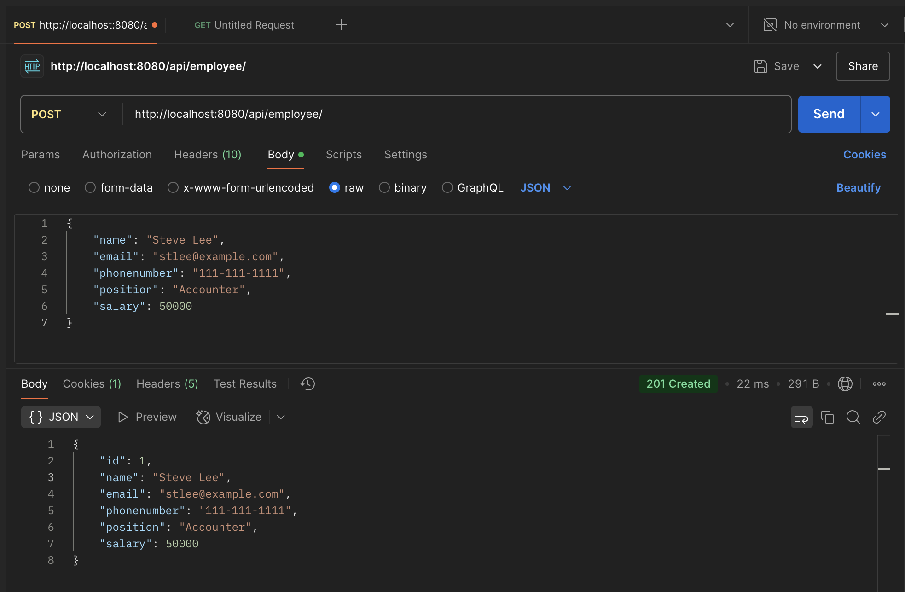
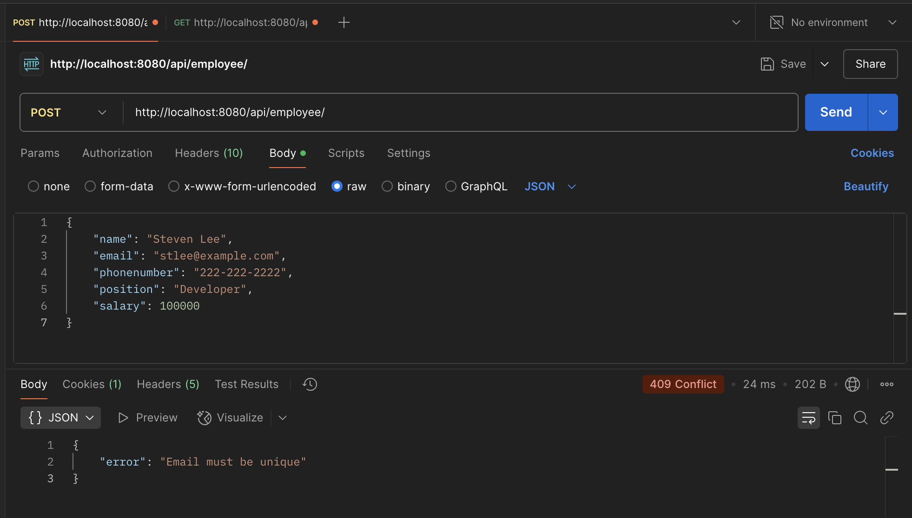
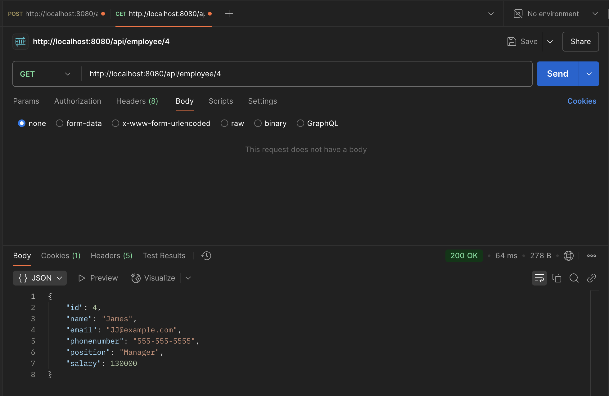
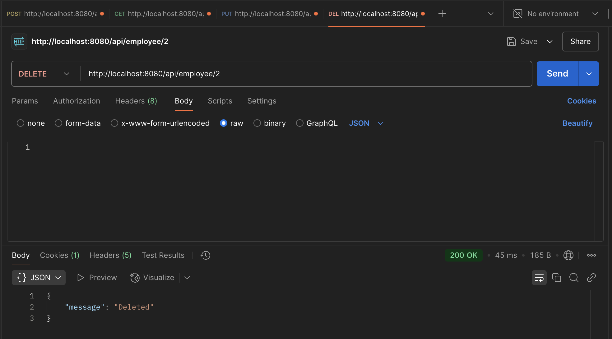
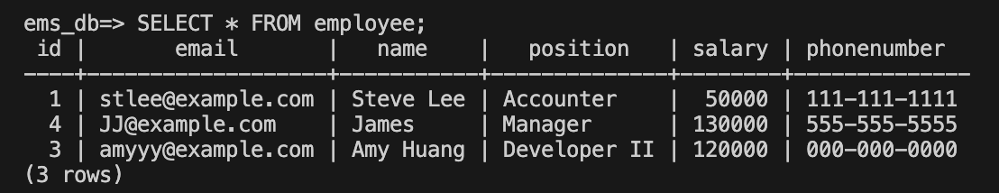

# Employee Management System (EMS)
## Overview
The Employee Management System (EMS) is a backend web application designed to manage employee data efficiently. Built with Java, Spring Boot, and PostgreSQL, the EMS allows organizations to perform essential CRUD (Create, Read, Update, Delete) operations on employee records. This tool simplifies the process of maintaining employee information, including names, emails, phone numbers, positions, and salaries, while ensuring smooth communication between frontend and backend through RESTful APIs.

## Technologies and Frameworks
* **Backend**:
    * Java: Programming language for backend implementation.
    * Spring Boot: Web framework used for building the backend API.
    * PostgreSQL: Relational database for storing employee records.
    * Spring Data JPA: ORM for interacting with PostgreSQL and managing entity persistence.
    
## Key Features
* CRUD Operations: Supports Create, Read, Update, and Delete operations for managing employee data.
* RESTful API: Exposes endpoints to interact with employee data, making it easy to connect to the frontend or other services.
* PostgreSQL Database: Employee data is stored and managed in PostgreSQL, providing secure and reliable data storage.
* Data Integrity: Ensures that employee emails are unique and prevents duplicates.

## How to Build and Run
#### Prerequisites
1. PostgreSQL: Ensure PostgreSQL is installed and running on your local machine or use a remote PostgreSQL instance.
2. Java: Make sure Java 17 or higher is installed on your system.
3. Maven: The project uses Maven for dependency management.

#### Backend Setup
1. Configure PostgreSQL
* Ensure your PostgreSQL database is running.
* Create a database for the application if not already created.
* Update the `application.properties` file to include your PostgreSQL connection details:
    ```bash
    spring.datasource.url=jdbc:postgresql://localhost:5432/ems_db
    spring.datasource.username=your_user_name # ems_user
    spring.datasource.password='your_password' # password123
    ```

2. Start the Spring Boot server:
    ```bash
    mvnw spring-boot:run
    ```
3. Access the API: The backend server will be running at http://localhost:8080. You can use tools like Postman or a frontend application to interact with the API.

    API Endpoints:
    * POST /api/employee: Create a new employee.
    * GET /api/employee: Get all employees.
    * GET /api/employee/{id}: Get a specific employee by ID.
    * PUT /api/employee/{id}: Update an existing employee by ID.
    * DELETE /api/employee/{id}: Delete an employee by ID.

## Results
**POST**

**POST** If a duplicate email is entered, the system will return a 409 status code with an appropriate error message.

**GET**

**DELETE**

**Final DB**


## Conclusion
The Employee Management System (EMS) simplifies the management of employee data by providing an easy-to-use backend that supports essential operations. By leveraging Spring Boot and PostgreSQL, the system ensures efficient data handling and scalability.

## Future Work
1. User Authentication: Add authentication mechanisms (e.g., JWT or OAuth) to secure access to the system.
2. Frontend Interface: Build a frontend application (e.g., using React or Angular) to interact with the backend API.
3. Search and Filter: Add search and filter functionalities to quickly find employee records.